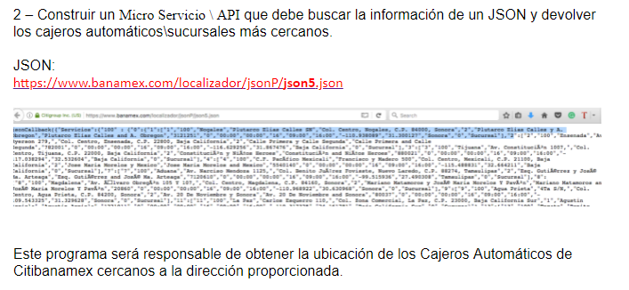
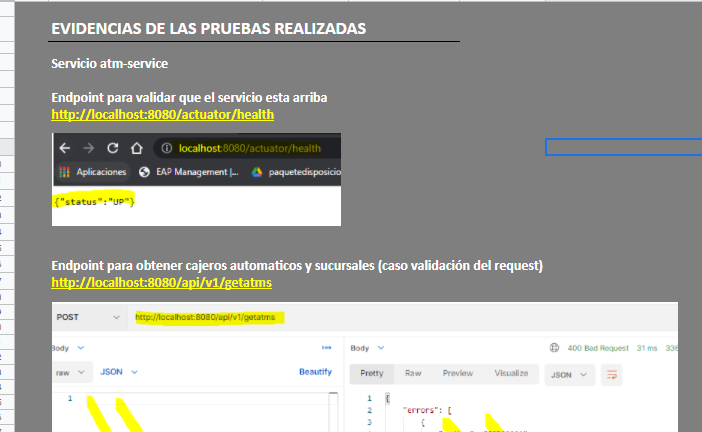
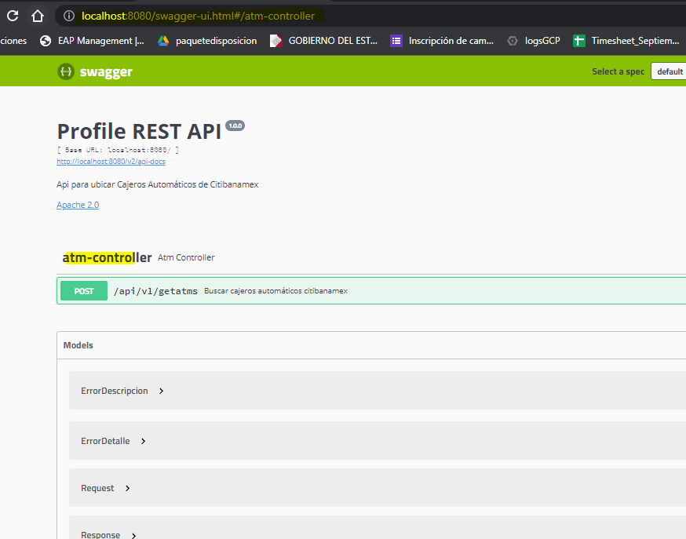
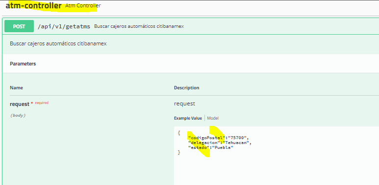
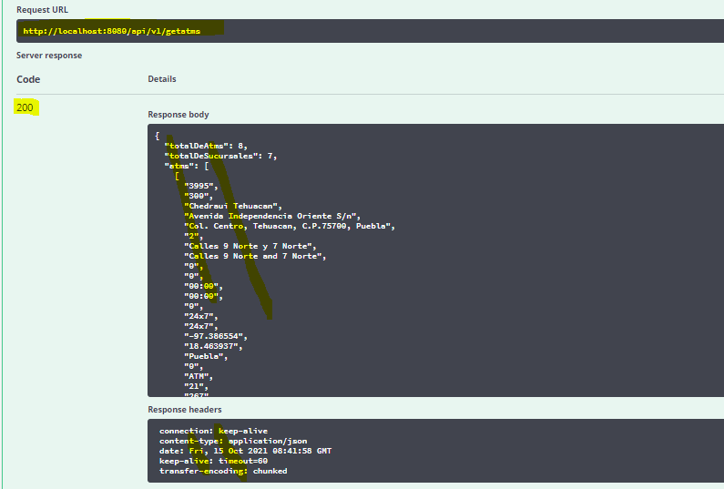
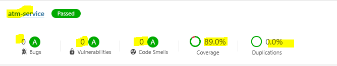

# atm-service 1.0.0
proyecto practica2 IBM

Api para ubicar Cajeros Automáticos de Citibanamex



# Requerimiento
Descripci&oacute;n del requerimiento ver [link](./documentacion/requerimiento/req.pdf)

# Tecnolog&iacute;as y dependencias relevantes
 - java 8
 - maven 3.6
 - spring-boot 2.5.5
 - spring-boot-data-jpa 2.5.5
 - spring-boot-actuator 2.5.5
 - springfox-swagger 2.9.2
 - jacoco-maven-plugin 0.8.3
 - h2 

# Source
```
# Clona este repositorio en un repositorio de Git local:
git clone https://github.com/amoralem/atm-service.git
```

# Pruebas y Evidencias 
-Pruebas en postman (ver el archivo adjunto de evidencia)

El endpoint: se encuntra configurado en el puerto 8080
http://localhost:8080/api/v1/getatms

-Evidencia ver [link](./documentacion/evidencia/evidencia.xlsx)



-Pruebas en swagger

url: http://localhost:8080/swagger-ui.html#/







# Sonarqube Code Quality


# Authors 
@2021 amoralesm
